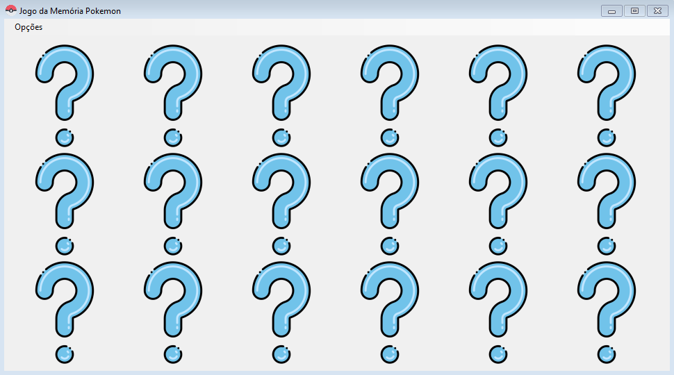
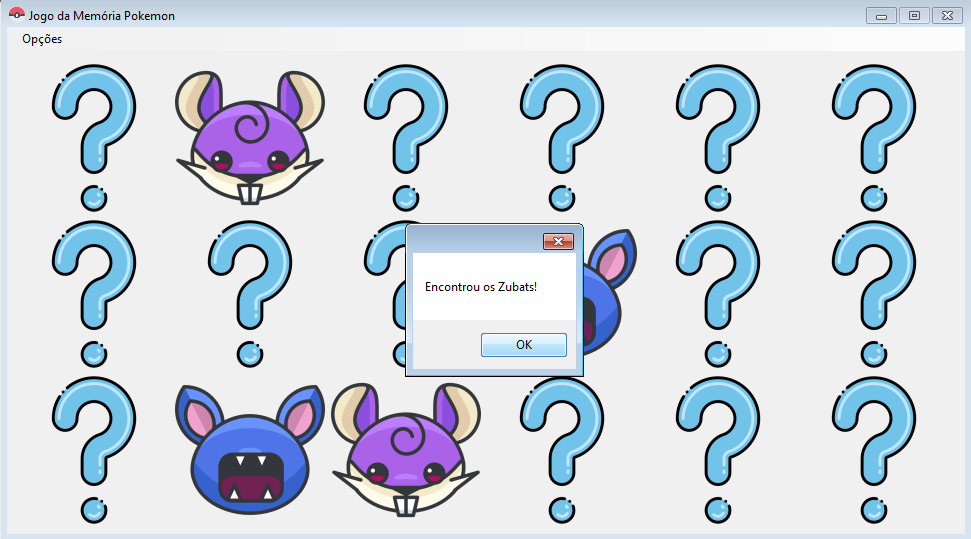
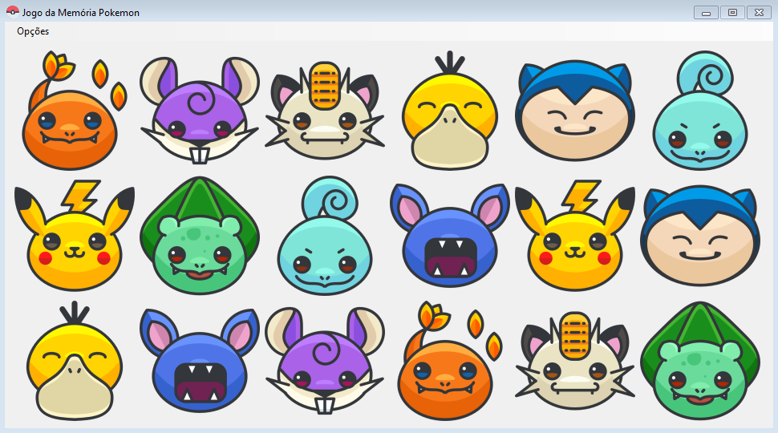

<!-- Título -->
<h1 align="center" id="title">Pokémon - Memory Game</h1>


<!-- Descrição -->
<h2 align="left" id="descricao">Descrição</h2>
<p align="justify">Esta é um jogo da memória bem simples e também primeiro projeto com layout desenvolvido em C#. Sua construção tem como objetivo aperfeiçoar os conhecimentos da linguagem e conhecer os componentes do C#, vale citar a utilização de imagens de Pokémons afinal, para aprender também é importante se divertir.  ;)</p>


<!-- Shield -->
<p>
	</img>
    </img>
	</img>
    </img>
    <!--</img>-->
</p>


<!-- Screenshots -->
<h2 align="left" id="screenshots">Screenshots</h2>
<p align="center">
  
  
  
</p>


<!-- Tecnologias -->
<h2 align="left" id="tecnologias">Tecnologias</h2>

As seguintes ferramentas foram usadas na construção do projeto:

- [.NET Core SDK](https://dotnet.microsoft.com/download)
- [VisualStudio](https://visualstudio.microsoft.com/pt-br/downloads/)


<!-- Pré-Requisitos -->
<h2 align="left" id="pre">Pré-Requisitos</h2>

Antes de começar, você vai precisar ter instalado o [.NET Core SDK](https://dotnet.microsoft.com/download) e para gerenciar esta aplicação é legal você contar com o [VisualStudio](https://visualstudio.microsoft.com/pt-br/downloads/) lembrando que se você optar por ele, é necessário uma conta [Microsoft](https://www.microsoft.com/mscomhp/onerf/signin?EEL=True&pcexp=True&ru=https%3A%2F%2Fwww.microsoft.com%2Fpt-br).


<!-- Executando o app -->
<h2 align="left" id="run">Rodando a aplicação</h2>

```bash
# Clone este repositório
$ git clone https://github.com/IN0C3NC10/PokemonMemoryGame.git

# Abra o projeto no seu Visual Studio

# Execute o projeto em "Iniciar"

# Vale lembrar que este projeto conta com um executável (.exe) então, é possível usar de forma direta
#  Local:(obj/Debug/PokemonMemory.exe)

#BeHappy!
```

<!-- Autor -->
<h2 align="left" id="autor">Autor</h2>
<p>
	<a href="https://github.com/IN0C3NC10">
		
	</a>
	<br />
	Feito com ❤️ por <strong>Bruno Inocencio</strong>!
</p>

<p align="left">
  <!-- Outlook -->
  <a href="mailto:bruno.inocencio@fatec.sp.gov.br" alt="Outlook" target="_blank">
    
  </a>
  <!-- Linkedin -->
  <a href="https://cutt.ly/nQlVjQV" alt="Linkedin" target="_blank">
    
  </a>
  <!-- GitHub -->
  <a href="https://github.com/IN0C3NC10" alt="GitHub" target="_blank">
    
  </a>
</p>
